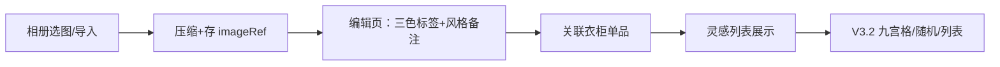

# Cloth 电子衣柜 V3 功能路线图

> 本文档为 **未来开发灵感库**，不绑定具体排期。当前 V2 已具备：衣柜、搭配、批量编辑、已扔掉、多色、跨设备 JSON 导入导出。

---

## 版本总览

| 版本 | 主题 | 优先级建议 | 依赖 |
|------|------|------------|------|
| V3.0 | 存储架构升级（必做前置） | P0 | 无 |
| V3.1 | 灵感库（收藏穿搭） | P1 | V3.0 推荐 |
| V3.2 | 显示模式切换 | P2 | V3.1 部分 UI 可复用 |
| V3.3 | 开屏推荐 + 打卡 | P2 | V3.1 / 现有搭配 |
| V3.4 | 颜色分析（本地） | P3 可选 | V3.0 + Canvas |

---

## V3.0 存储架构升级（强烈建议先于灵感库）

### 现状与风险

- 衣物照片以 **JPEG base64** 存在 `localStorage`（`wardrobe_clothes_v1`），单张约 **200–400KB**。
- 粗算：120 件 × 300KB ≈ **36MB**；浏览器 `localStorage` 通常仅 **5–10MB**，App 端也易卡顿、导出 JSON 巨大。
- 灵感库持续增长后，**继续全量 base64 不可持续**。

### 推荐方案（纯本地、无付费、无联网）

```
┌─────────────────────────────────────────────────────────┐
│  元数据（JSON，localStorage / uni.storage）              │
│  id, name, colors[], type, temp, clothIds, ...          │
│  imageRef: "img_xxx"   ← 只存引用，不存 base64           │
└─────────────────────────────────────────────────────────┘
                          │
          ┌───────────────┼───────────────┐
          ▼               ▼               ▼
    H5: IndexedDB    App: 本地文件      导出包:
    存 Blob/base64   _doc/cloth/       可选「仅元数据」
                     xxx.jpg            或「含图 zip」
```

| 层级 | 内容 | 规格建议 |
|------|------|----------|
| **衣物图** | 列表/详情共用 | 宽 800px、约 400KB 内（与录入压缩一致） |
| **灵感图** | V3.1 再定 | 可与衣物同规格或略小 |

**已实现（V3.0）**：无旧数据迁移；导入仅 `version: 3`。

**导出/导入 V3 bundle**：

```json
{
  "version": 3,
  "exportedAt": 1234567890,
  "clothes": [ { "id": "...", "imageRef": "img_1", ... } ],
  "matches": [],
  "inspirations": [],
  "images": { "img_1": "data:image/jpeg;base64,..." }
}
```

跨设备仍可用「一个 JSON + 内嵌 images 字典」，大账号建议 **分卷导出** 或提示「图片过多请分批」。

---

## V3.1 灵感库（收藏穿搭）✅ 已实现

### 页面

- 路由：`pages/inspiration/inspiration.vue`
- 顶栏 Tab 扩展：`衣柜 | 搭配 | 灵感`（`MainTabs` 增一项）

### 数据模型 `InspirationItem`

```typescript
interface InspirationItem {
  id: string
  name?: string                    // 可选标题
  imageRef: string                 // V3.0 图片引用
  colorTags: {
    primary: string[]              // 主色（多选预设名或自定义）
    secondary: string[]            // 辅色
    accent: string[]               // 点缀色
  }
  style?: '通勤' | '休闲' | '约会' | '运动' | string
  occasion?: string                // 场合自由文本
  season?: '夏' | '春秋' | '冬' | ''
  note?: string
  links: InspirationLink[]         // 与衣柜关系
  createdAt: number
  source?: 'album' | 'import'      // 来源
}

interface InspirationLink {
  clothId: string
  relation: 'have_similar' | 'want_to_buy'  // 我有类似 / 需要购买
  note?: string
}
```

存储键：`wardrobe_inspirations_v1`（元数据 JSON）+ 图片走 V3.0 统一 `imageStore`。

### 核心流程



### UI 要点

- **录入/编辑**：大图预览；主色/辅色/点缀色三组 chip（复用 `PRESET_COLORS` + 多选）；风格四选一 + 场合输入；季节 chip。
- **关联**：底部「从衣柜选择」多选，每件标记「类似已有」或「想买」；列表展示小圆点 + 关系标签。
- **筛选**：按风格、季节、主色、是否含「想买」筛选。

### 与 V2 衔接

- 筛选主色时，可调用 `itemMatchesColor(cloth, color)` 反查衣柜。
- 导出 V3 bundle 时 `inspirations` 数组一并打包。

---

## V3.2 显示模式切换

适用：**灵感列表**、可选扩展到 **搭配列表**。

| 模式 | 说明 | 实现要点 |
|------|------|----------|
| **列表** | 当前三列紧凑卡片 | 默认，`ClothCard` / 新 `InspirationCard` |
| **九宫格** | 一屏约 9 张，仅图+短标题 | `grid 3×3`，`imageRef` 缩略图，`rpx` 按屏宽 |
| **随机放大** | 进入页随机 1 张全屏 | `onShow` 随机 index；左右滑或按钮换下一张 |

**状态持久化**：`uni.setStorageSync('view_mode_inspiration', 'grid' | 'list' | 'random')`。

**响应式**：

- 小屏（&lt;360px 逻辑宽）：九宫格仍 3 列，间距缩小。
- 平板/横屏：九宫格可 4–5 列（`uni.getSystemInfoSync().windowWidth` 计算列数）。

---

## V3.3 开屏推荐

### 行为

1. App / H5 启动 → `pages/splash/splash.vue`（或 `App.vue` onLaunch 跳转一次）。
2. 数据源：**随机一套 `MatchItem`**，若无搭配则随机 **`InspirationItem`**。
3. 展示：主图拼图（搭配内多件缩略图拼接）或灵感单图；名称；`formatTempRange` 聚合（取搭配内衣物温度交集文案）；风格/场合来自灵感或搭配备注。
4. 按钮：
   - **今天穿这套** → 写入 `wardrobe_checkin_v1`（日期 + matchId/inspirationId）→ `redirectTo` 衣柜或搭配详情。
   - **换一套** → 重新随机（排除刚展示的 id，池子空则允许重复）。

### 数据 `CheckInRecord`

```typescript
{ date: '2026-05-19', type: 'match' | 'inspiration', refId: string }
```

可选统计页：日历打点（V3.5+）。

### 注意

- 开屏页需 **跳过首次安装引导** 逻辑；用户设置「关闭开屏推荐」存 `settings.disableSplash`。

---

## V3.4 颜色分析（进阶）— 无需付费 API

### 结论（直接回答你的顾虑）

| 问题 | 答案 |
|------|------|
| 要收费吗？ | **不需要**。不用 OpenAI / 云端识色。 |
| 要联网吗？ | **不需要**。H5 / App 本地 Canvas 即可。 |
| 能实现吗？ | **可以**。用 Color Thief（MIT）或自写「缩小图 + 统计像素」提取主色。 |

### 限制

- **微信小程序**：Canvas 2D 可用，包体积需控制；主包过大可放分包。
- **性能**：先缩到 100×100 再采样，避免大图卡顿。
- **准确度**：复杂印花不如纯色块准，结果作「参考」即可。

### 功能设计（若做）

1. 用户选灵感图 / 搭配拼图 → 提取 3–5 个主色（hex）。
2. 自动填入 V3.1 的 `colorTags.primary` 等（用户可改）。
3. **推荐衣柜**：`getClothes()` 中 `colors` 与提取色 ΔE 或简单 RGB 距离 &lt; 阈值。
4. **和谐度（轻量）**：规则引擎，非 AI——例如 60% 中性色 + 30% 主色 + 10% 点缀，显示文字建议「偏安全」「可尝试对比色」。

### 不建议

- 首版就上云端 Vision API（有费用、要隐私说明、要备案）。

---

## 响应式布局（全局）

| 断点（逻辑宽 px） | 衣柜/灵感列数 | 字号缩放 |
|-------------------|---------------|----------|
| &lt; 360 | 3 列 | 基准 |
| 360–480 | 3 列 | 基准 |
| &gt; 480（平板） | 4–5 列 | +2rpx |

封装 `utils/layout.js`：

```javascript
export function getGridColumns() {
  const w = uni.getSystemInfoSync().windowWidth
  if (w >= 480) return 4
  return 3
}
```

安全区：`padding-bottom: env(safe-area-inset-bottom)`（现有 FAB/底栏已部分使用，V3 统一）。

---

## 建议目录结构（V3 增量）

```
pages/
  inspiration/
    inspiration.vue      # 列表 + 模式切换
    inspirationEdit.vue  # 录入/编辑
  splash/
    splash.vue           # 开屏推荐
utils/
  imageStore.js          # IndexedDB / 文件统一读写
  inspirationStorage.js
  checkinStorage.js
  colorExtract.js        # V3.4 本地取色
components/
  InspirationCard.vue
  ViewModeSwitch.vue
docs/
  V3-ROADMAP.md          # 本文档
```

---

## 推荐实施顺序

1. **V3.0** 图片存储改造 + 迁移（否则 120+ 件 + 灵感会崩）。
2. **V3.1** 灵感 CRUD + 衣柜关联。
3. **V3.2** 三种视图（复用灵感数据）。
4. **V3.3** 开屏 + 打卡。
5. **V3.4** 本地取色（锦上添花）。

---

## 应用品牌（已配置项）

- 应用名：**Cloth**
- 图标：`static/app-icon.png`（挂衣轮廓线稿）
- HBuilder 云打包：在「App 图标」处指向该图，或由工具生成各尺寸 iOS/Android 图标集。

---

## 附录：V2 → V3 存储键一览

| 键名 | 用途 |
|------|------|
| `wardrobe_clothes_v1` | 衣物元数据 |
| `wardrobe_matches_v1` | 搭配 |
| `wardrobe_inspirations_v1` | 灵感（V3.1） |
| `wardrobe_checkin_v1` | 打卡（V3.3） |
| `wardrobe_image_db` | IndexedDB 名（V3.0） |
| `view_mode_inspiration` | 显示模式（V3.2） |
